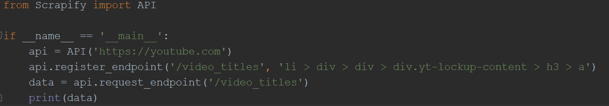
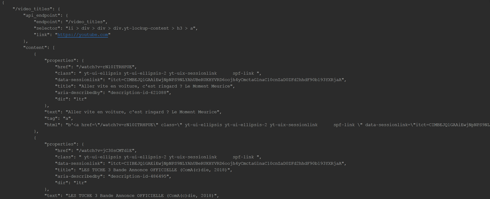

## Scrapify

A python library that allows dead easy web scraping with 3 lines of code.

Just copy-paste Scrapify.py with the required dependencies to start using it in your project <3

## How it works

Scrapify relies on lxml and Requests to crawl web pages and return a JSON representation of what is demanded.

You can set up different endpoints to request those as much as you want.

## Dependencies

I couldn't manage to upload this library to PyPi.  

For this library to work properly in your project, **it is mandatory that you install those dependencies** :
 - lxml.
 - requests.
 - unidecode.
 - json.

## Usage 

I want to retrieve the video title for each video on the Youtube homepage.

# Documentation

Scrapify lets you use those functions :  

	API(default_endpoint)
	
Provide the default **link** the API will scrap.   Default value is **None**
	----
    set_default_endpoint(link)

It's just a shorthand for using the **constructor** with a parameter.  
Returns nothing.
	----
    register_endpoint(identifier,selector,link)

Add a new **endpoint** to the API, identified by :

 - An **identifier** string (it's a key) (ex: "/video_titles" REST like)
 - A **selector** string which is a CSS selector for what you want to retrieve (ex: "li")
 - A **link** *optional* string. If not provided, the API will use the default endpoint.  It is the URL of the webpage you want to scrap. 
Returns nothing.
	----
	update_endpoint(identifier,selector,link)

It's just a shorthand for **register_endpoint** when an endpoint exists already.  
Returns nothing.

	----
    
    remove_endpoint(identifier)

Remove an **endpoint** registered in the past, identified by an **identifier** string stored already via **register_endpoint**.   Returns nothing.
	----
    request_endpoint(identifier,filter,is_filter_including)

Scrap the webpage identified by the **identifier** provided and the **css selector** you associated the identifer to.

- **filter** is an *optional* array of strings you want to use as a filter on the results from the scraping process. Default value is **None**.
- **is_filter_including** is an *optional* boolean that tells wether your filter will **exclude data or include data** during the scraping process.  Default value is **False**.

Returns a **JSON string** containing the results.
	----
	endpoint_list()
Returns the list of all the endpoints registered already.

# Contribute

Do not hesitate to make pull requests in case there is any kind of bug or missing functionality you would love to see.

Also, if you're a pro with PyPi, feel free to upload this library ! It will ease the install process.  **Contact me before**
